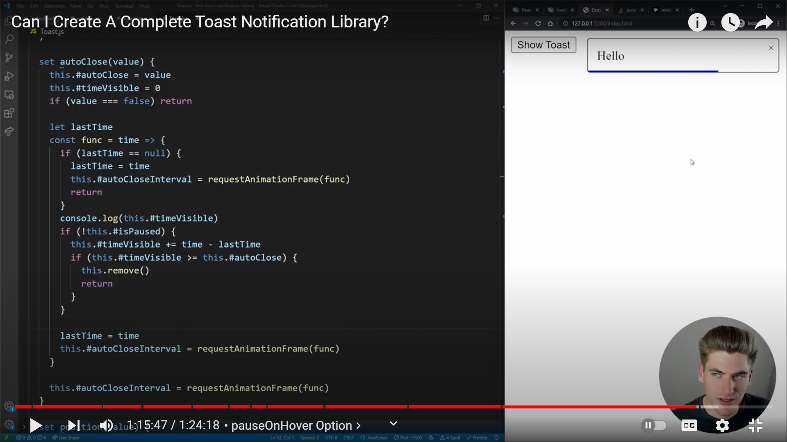

# Prototype react-tostify with vanilla js

## Progress bar calculation logic

### How to Calculate the Progress

To update the progress bar every 10 milliseconds over a total of 5000 milliseconds:

1. **Total Steps**: Since you're updating every 10 milliseconds, the total number of steps (or intervals) will be 5000ms / 10ms = 500 steps.

2. **Increment Per Step**: The progress bar goes from 0% to 100% in these 500 steps. So, the increment in each step would be 100% / 500 = 0.2% per step.

3. **Progress Value Calculation**: At each interval (every 10 milliseconds), you'll increase or decrease the progress value by 0.2%.

**Summary**

1. Divide the total time by the interval to get the number of steps.

2. Calculate the increment per step.

3. At each interval, update the progress bar by the calculated increment.

4. Continue this until the progress reaches 100% (increasing) or 0% (decreasing).

# Reference

https://www.youtube.com/watch?v=HhpbzPMCKDc [Mind Blowing lecture, spending every second is worth here]

- Every thought process in this lecture is worth giving time. There is a lot of take-aways from this lecture.

- Learn how a npm-like-library can be build using simple vanilla js.

- Build an how-to-approach-a-problem-then-to-entire-project thought process

- key-moments

  - How animation is added using requestAnimationFrame() and css transition by adding .show class dynamically. [https://youtu.be/HhpbzPMCKDc?t=2214]

  - His code for finding elapsed time to pause on hover and do autoClose after removing the pause duration -

  
